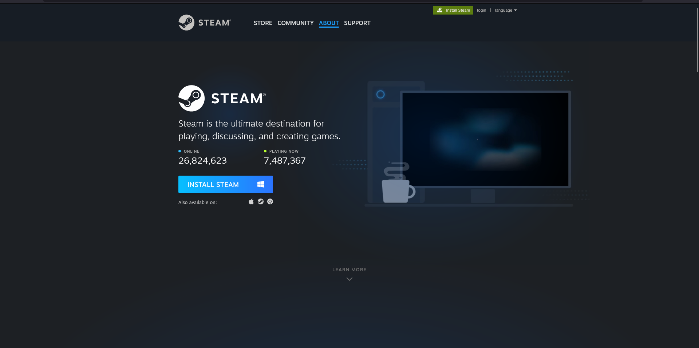
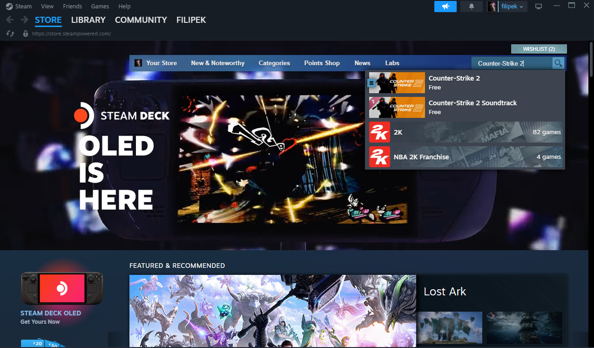

# Easy to download
It is very easy to download CS2. All you need to do is follow this step by step guide:

## 1. Install Steam
To install steam follow this link: [steam.com](https://store.steampowered.com/about/)

You will probably see a page something like this:

Follow the steps on the Steam website

## 2. Create an account
After installing Steam, you will need to register or log-in to your account. This account will be used throughout your entire Steam library.

## 3. Getting CS2
Because CS2 is free, all you need to do is go to the store and in search look up: Counter-Strike 2. 

Click on it, scroll down a bit and click **Add to library**. 
This will add the game to your Steam library and all that is left is to download the game in your library.

